# Documentation of Project 4

## Step 1: Install NodeJS
- Update ubuntu via `sudo apt update`
- Upgrade ubuntu via `sudo apt upgrade`
- Add certificates using:

`sudo apt -y install curl dirmngr apt-transport-https lsb-release ca-certificates`
`curl -sL https://deb.nodesource.com/setup_12.x | sudo -E bash -`
- Install NodeJS via `sudo apt install -y nodejs`
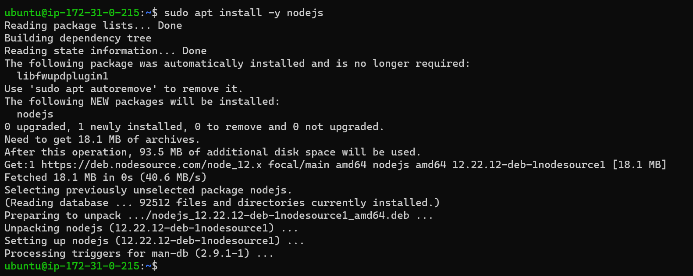

## Step 2: Install MongoDB
- `sudo apt-key adv --keyserver hkp://keyserver.ubuntu.com:80 --recv 0C49F3730359A14518585931BC711F9BA15703C6`
- `echo "deb [ arch=amd64 ] https://repo.mongodb.org/apt/ubuntu trusty/mongodb-org/3.4 multiverse" | sudo tee /etc/apt/sources.list.d/mongodb-org-3.4.list`
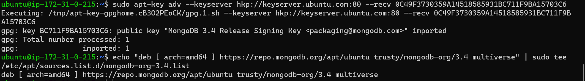
- Install MongoDB via `sudo apt install -y mongodb`
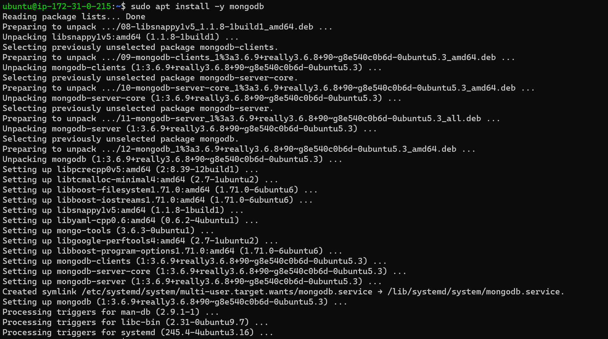
- Start server via `sudo service mongodb start`
- Verify that server is up and running, using `sudo systemctl status mongodb`
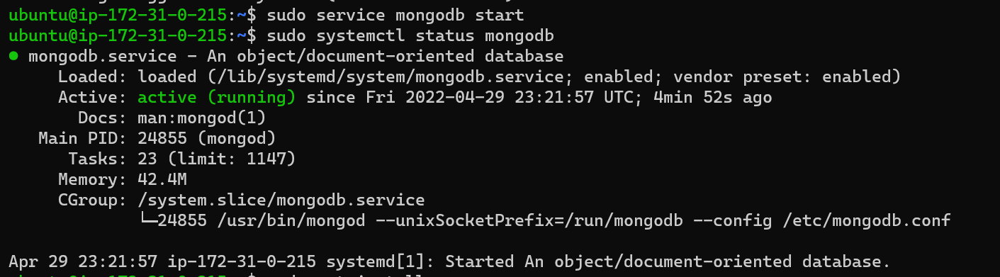
- Install npm (Node package manager) via `sudo apt install -y npm`
- Install body-parser package to help process JSON files passed in requests to the server: `sudo npm install body-parser`
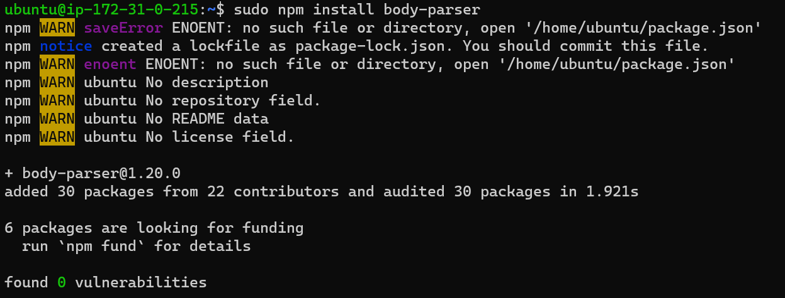
- Create folder named ‘Books’: `mkdir Books && cd Books`
- In Books directory, initialize npm project `npm init`
- Add a file named server.js to the directory `vi server.js`
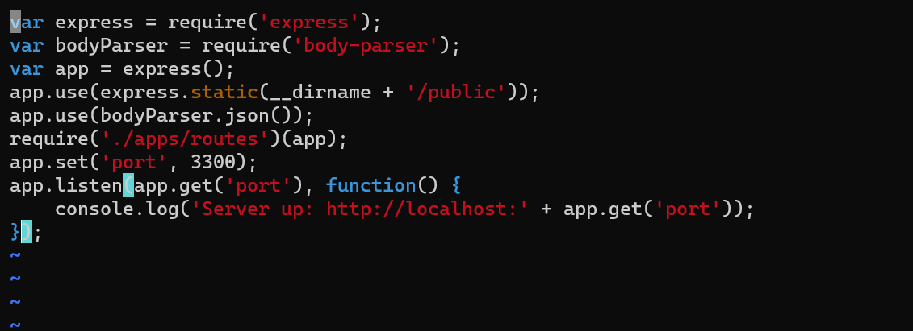
- Copy and paste the web server code below into the server.js file.

## Step 3: Install Express and Set Up Routes to the Server
- Install Mongoose to establish a schema for the database to store data of the Book register: `sudo npm install express mongoose`
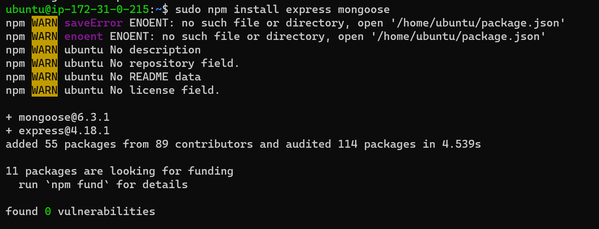
- In ‘Books’ folder, create a folder named apps: `mkdir apps && cd apps`
- Create a file named routes.js: `vi routes.js`
- Type code below into routes.js:
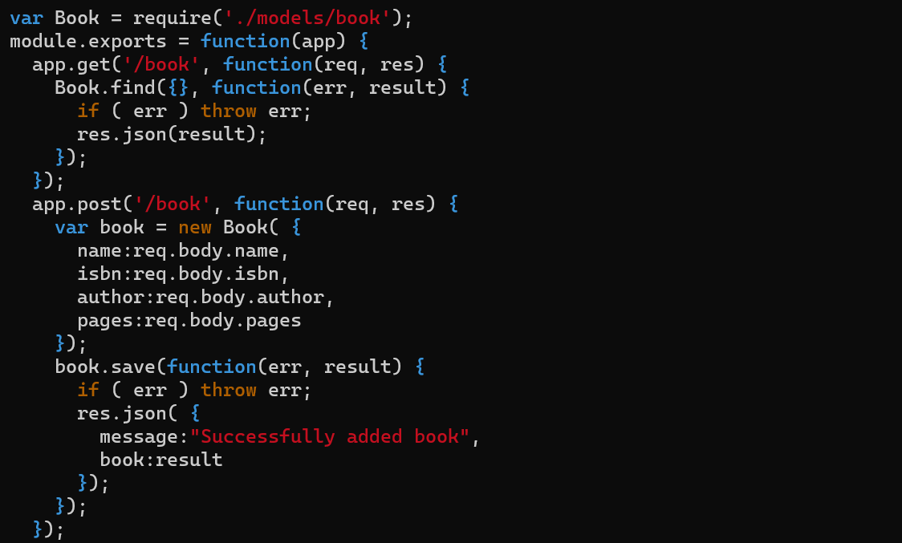
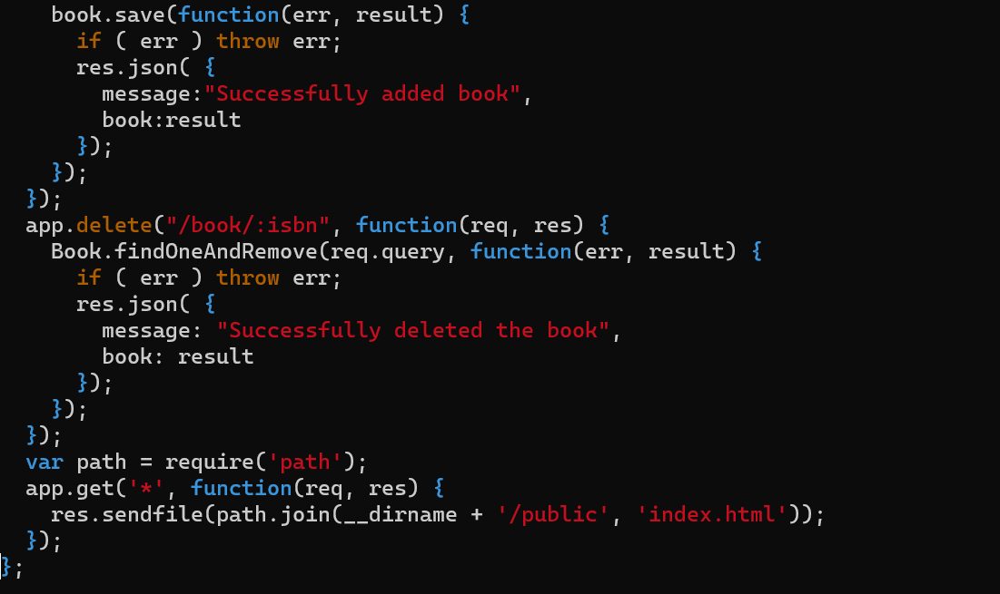
- Create a file named book.js: `vi book.js`
- Type code below into ‘book.js’
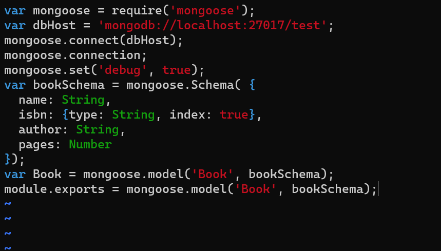

## Step 4 – Access the Routes with AngularJS
- Change the directory back to ‘Books’: `cd ../..`
- Create a folder named public: `mkdir public && cd public`
- Add a file named script.js: `vi script.js`
- Type code below (controller configuration defined) into the script.js file
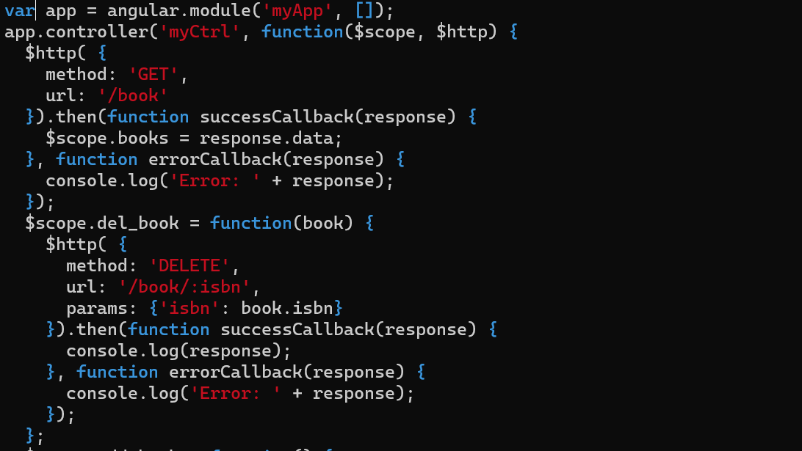
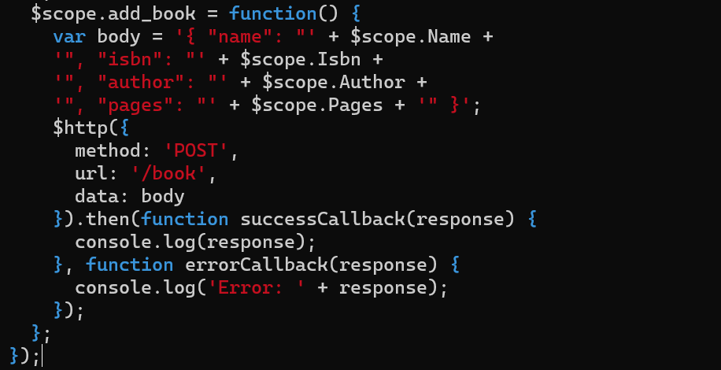
- In public folder, create a file named index.html: `vi index.html`
- Type code below into index.html file:
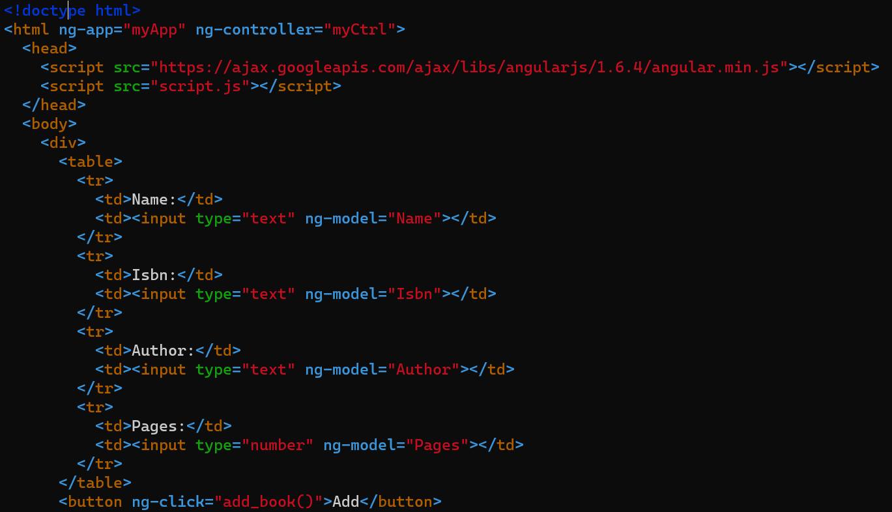
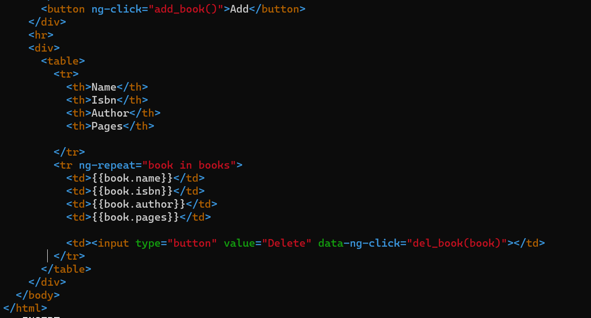
- Change the directory back up to Books: `cd ..`
Start the server by running `node server.js`
- Server is now up and running and can be connected via port 3300. 
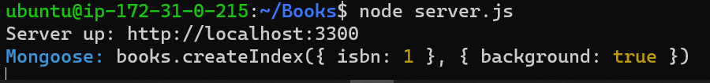
- Test what curl command returns locally: `curl -s http://localhost:3300`
- Open TCP port 3300 in AWS Web Console for EC2 Instance
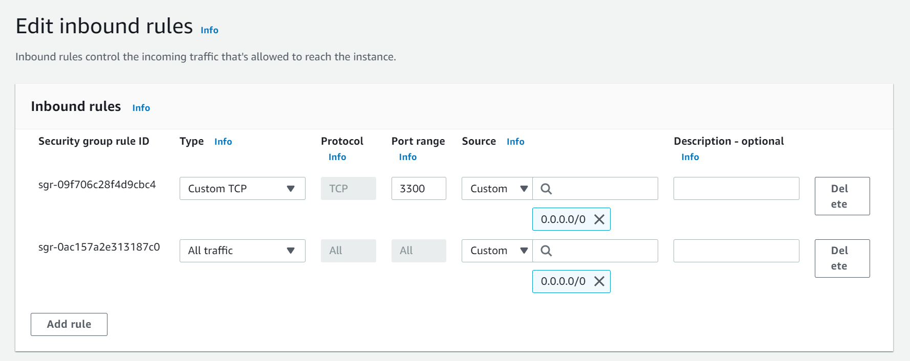
- Access Book Register web application from the Internet with a browser using Public IP address or Public DNS name
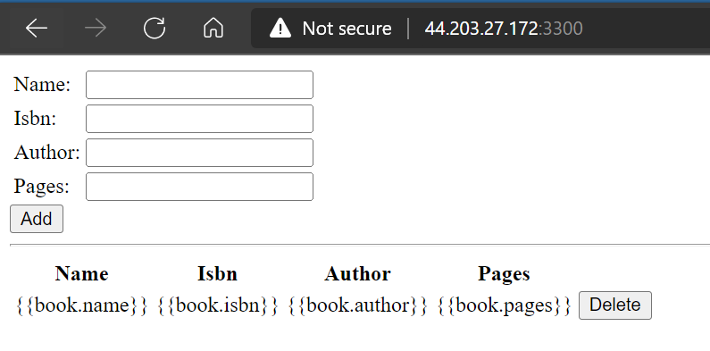

